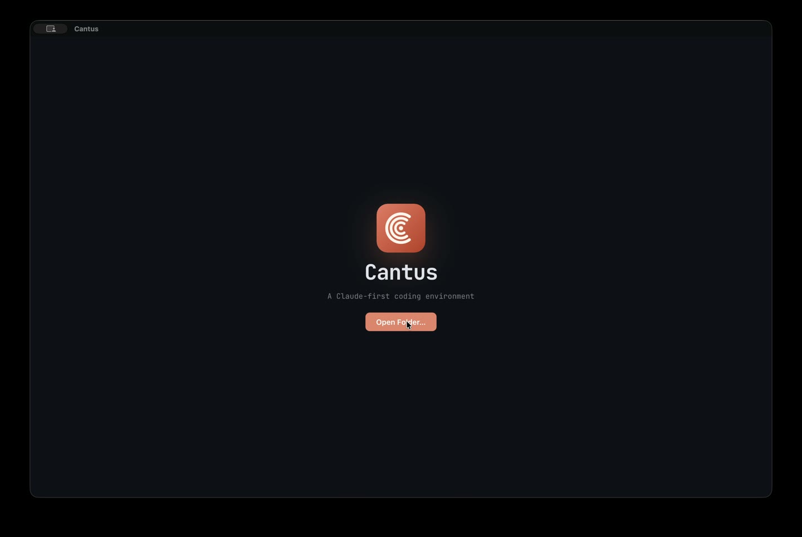
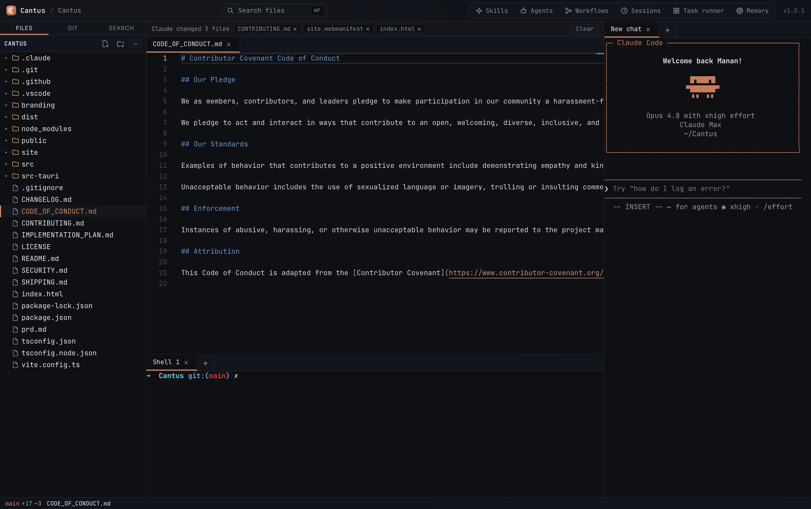
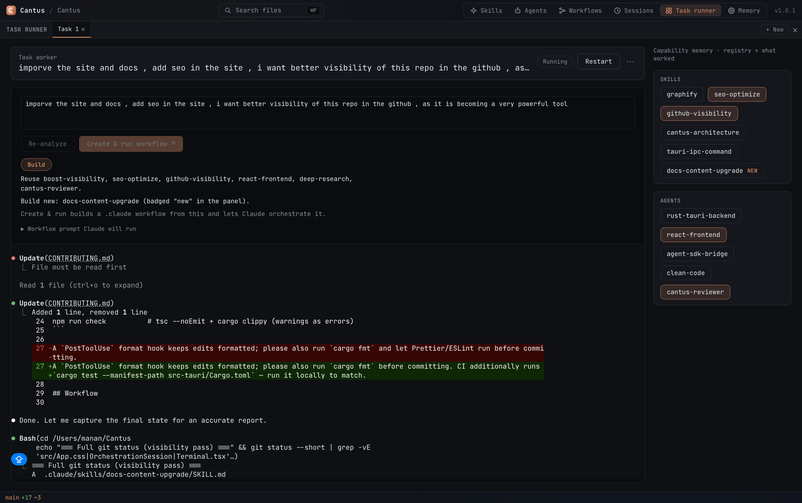
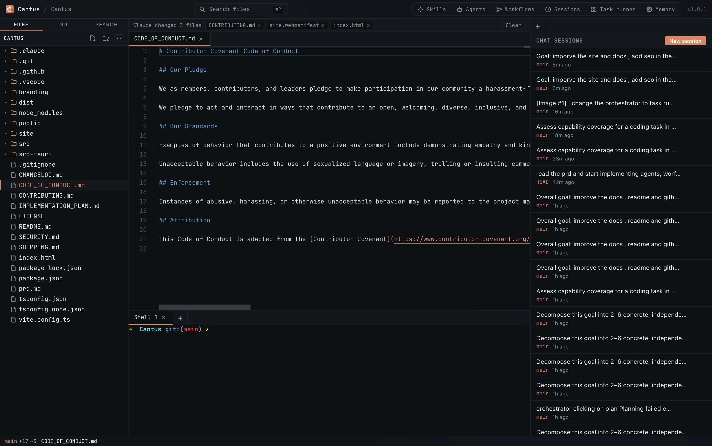
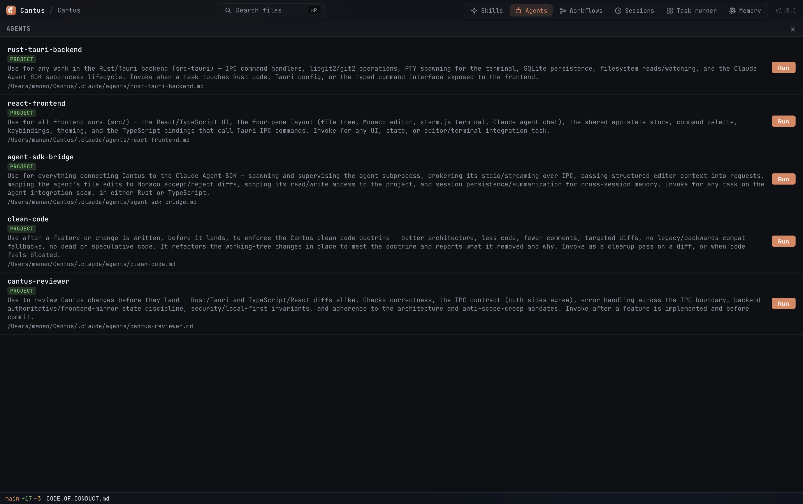
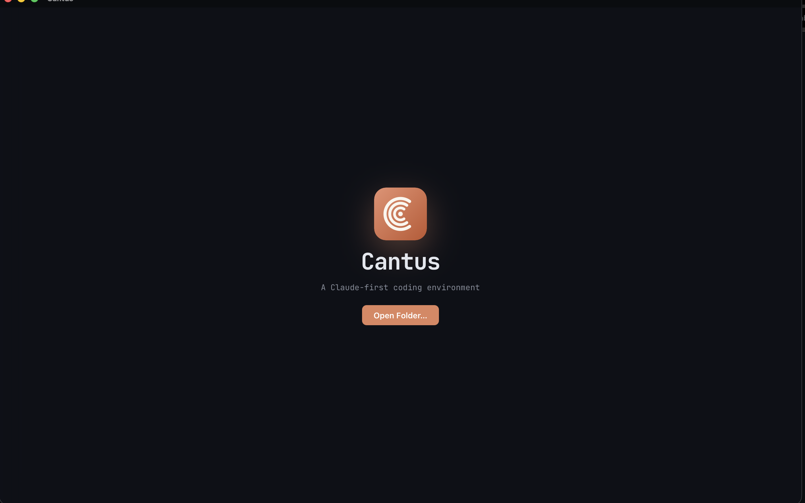

<p align="center">
  
</p>

<h1 align="center">Cantus — a Claude-first desktop coding environment for macOS</h1>

<p align="center">
  <b>The open-source IDE and GUI for <a href="https://docs.claude.com/en/docs/claude-code/overview">Claude Code</a> on macOS — the real <code>claude</code> CLI in an integrated terminal, beside a Monaco editor and built-in git, all in one native window. Local-first, private, and free. Built with Tauri 2, Rust, and React — no Electron, no subscription.</b>
</p>

<p align="center">
  <a href="https://github.com/manan45/Cantus/actions/workflows/ci.yml"></a>
  <a href="LICENSE"></a>
  
  
  
</p>

<p align="center">
  <a href="https://github.com/manan45/Cantus/releases/latest"><b>Download</b></a> ·
  <a href="#why-cantus">Why</a> ·
  <a href="#features">Features</a> ·
  <a href="#how-cantus-compares">Comparison</a> ·
  <a href="#getting-started">Getting started</a>
</p>

<p align="center">
  <a href="https://manan45.github.io/Cantus/" title="Watch the Cantus demo">
    
  </a>
  <br />
  <a href="https://manan45.github.io/Cantus/"><b>▶ Watch the 84-second demo</b></a>
</p>

---

## What is Cantus?

**Cantus is a Claude-first desktop coding environment for macOS (Apple Silicon) — a real IDE and GUI built around the [Claude Code](https://docs.claude.com/en/docs/claude-code/overview) CLI.** One native window puts a [Monaco](https://microsoft.github.io/monaco-editor/) editor, an integrated [xterm.js](https://xtermjs.org/) terminal running the `claude` CLI in a backend-spawned PTY, [libgit2](https://libgit2.org/) git with per-hunk **and** per-line staging, resumable Claude sessions, a capability-aware task runner, and a local SQLite + FTS5 learned-memory store — all side by side.

It composes mature, battle-tested components into **one coherent app** rather than reinventing them, and builds only the glue and the genuinely novel parts. Built on [Tauri](https://tauri.app/), it ships as a small native binary with zero external setup.

**Local-first and private:** everything stays on your machine — the only thing that leaves is Claude's own model API calls.

> **One thesis:** the `claude` CLI you already use deserves a real IDE around it — editor, terminal, git, and file tree in one window — instead of alt-tabbing between your editor and a lone terminal.

### Install

```bash
# Homebrew (macOS, Apple Silicon) — recommended
brew tap manan45/cantus
brew install --cask cantus

# …or in one line, without tapping first:
brew install --cask manan45/cantus/cantus
```

Prefer a direct download? Grab the latest `.dmg` from the [releases page](https://github.com/manan45/Cantus/releases/latest).

> Builds are currently **unsigned**, so Gatekeeper warns on first launch. After installing, clear the quarantine flag once — or right-click the app → **Open**:
>
> ```bash
> xattr -dr com.apple.quarantine /Applications/Cantus.app
> ```
>
> Cantus drives the `claude` CLI in its integrated terminal — install it with `npm install -g @anthropic-ai/claude-code`. Prefer building from source? See [Getting started](#getting-started).

## Why Cantus?

Today's tooling forces a compromise:

- **Terminal agents** like Claude Code are deeply capable, but live in a bare terminal with no editor, no git UI, and no file tree beside them.
- **GUI IDEs** bolt AI on as a side panel, and you give up the terminal-native agent you actually like.
- **Stitching them together** makes *you* the integration layer: editor here, Claude in a terminal there, git in a third window.

Cantus closes the gap by giving Claude Code a real workspace — editor, terminal, and git sharing one UI and one project.

## How Cantus compares

Where a dedicated **Claude Code GUI** fits — Cantus vs. running Claude Code in a bare terminal, vs. a GUI IDE with a bolted-on AI side panel. Unlike a session-manager wrapper, Cantus is a full IDE workspace: editor, terminal, and git share one window and one project.

|  | Cantus | Bare Claude Code in a terminal | A GUI IDE with an AI side panel |
|---|---|---|---|
| The agent | The real `claude` CLI in an integrated PTY | The real `claude` CLI, but alone | A bolted-on chat panel, not the CLI you know |
| Editor | Monaco, beside the agent | None | Yes |
| Git UI | libgit2, per-hunk **and** per-line staging | None (shell only) | Varies |
| Stays local & private | Yes — source never leaves the machine¹ | Yes | Often cloud-assisted |
| Footprint | Small native Tauri binary — no Electron | Tiny | Large (often Electron) |
| Cost & licensing | Free, open-source (MIT) | Free | Often paid / subscription |

<sub>¹ Except Claude's own model API calls. Cantus is not affiliated with Anthropic; "Claude" and "Claude Code" are Anthropic's.</sub>

## Features

- 🎛️ **Four-pane workspace** — file tree, Monaco editor, terminal, and Claude, in one resizable window.
- 🖥️ **Claude in a real terminal** — the `claude` CLI runs in a backend-spawned PTY, full-width and resumable.
- 📎 **Drag files into Claude** — drop any file onto the terminal to insert its path straight into the prompt.
- 🔍 **VS Code-style diff** — split / inline views with collapsed unchanged regions and per-hunk **and** per-line stage / discard.
- 🌿 **Built-in git** — status, branch switcher, stage, commit, and discard — via libgit2, no shelling out.
- 💾 **Resumable sessions** — your Claude sessions for the project, listed and resumable from the integrated terminal.
- 🎛️ **Capability-aware task runner** — describe a task; Claude summarizes which skills & agents apply (reuse / compose / build), assembles a `.claude` workflow, and runs it — orchestrating itself.
- 🧠 **Learned memory** — a local SQLite + FTS5 store distills the quirks each run teaches and relevance-retrieves the right ones into the next run's plan. No cloud, no vector service.
- 📊 **IDE monitor** — a status-bar widget for system + Cantus CPU/memory, the live count and footprint of running `claude` processes, and today's + total token usage parsed from the project's transcripts.
- 🔒 **Local-first & private** — your source never leaves the machine except as Claude's own model calls. No telemetry, no account, no subscription.
- 🎨 **Crafted UI** — deep dark palette, glassmorphism chrome, and JetBrains Mono throughout.

## Screenshots

See Cantus in action — the workspace, the task runner, sessions, the capability browser, and first run.

<p align="center">
  
  <br>
  <sub><b>The four-pane workspace</b> — file tree, Monaco editor, the <code>claude</code> CLI in an integrated terminal, and an embedded shell, all in one resizable window.</sub>
</p>

<p align="center">
  
  <br>
  <sub><b>Capability-aware task runner</b> — describe a goal; Cantus shows which skills and agents apply, assembles a <code>.claude</code> workflow, and runs it.</sub>
</p>

<p align="center">
  
  <br>
  <sub><b>Resumable sessions</b> — every Claude session for the project, listed and resumable in the integrated terminal.</sub>
</p>

<p align="center">
  
  <br>
  <sub><b>Skills, Agents &amp; Workflows browser</b> — everything available to the task runner, each runnable in a click.</sub>
</p>

<p align="center">
  
  <br>
  <sub><b>First run</b> — open any folder to start a project.</sub>
</p>

## Tech stack

| Layer | Choice |
|---|---|
| App framework | Tauri 2 (Rust core + web frontend) |
| Frontend | TypeScript + React + Vite |
| Editor | Monaco |
| Terminal | xterm.js + PTY |
| Version control | libgit2 via the `git2` crate |
| AI | the `claude` CLI, in the integrated terminal |
| Local store | SQLite (with FTS5 for learned memory) |

## Getting started

### Prerequisites

- macOS on Apple Silicon
- [Rust](https://rustup.rs/) (stable, 1.85+) and [Node.js](https://nodejs.org/) 20+
- Xcode Command Line Tools: `xcode-select --install`

### Run in development

```bash
git clone https://github.com/manan45/Cantus.git
cd Cantus
npm install
npm run tauri dev
```

### Build a release binary

```bash
npm run tauri build
```

### Quality checks

```bash
npm run check   # tsc --noEmit + cargo clippy (warnings as errors)
```

## Project structure

```
src/            React + TypeScript frontend (the four panes, shared state, IPC bindings)
src-tauri/      Rust backend (typed IPC commands, git, PTY, SQLite)
branding/       Logo, icon, and banner source
.github/        CI, release, and the Claude Code GitHub Action
```

The frontend and backend talk **only** through typed Tauri IPC commands and events; the backend is authoritative for filesystem, process, and store state.

## Roadmap

- **Phase 1 — MVP** *(shipped in v1.0)* — the four-pane shell, Claude in the terminal, git with hunk/line staging, persistence.
- **Phase 2 — Depth** *(shipped in v1.1)* — a Skills / Agents / Workflows / Sessions browser, multiple project windows, quick-open (⌘P) + project search, and drag-files-into-terminal.
- **Phase 3 — Orchestration** *(shipped in v1.1)* — a capability-aware task runner that builds and runs `.claude` workflows, plus a local learned-memory layer.
- **Phase 4 — Insight** *(shipped in v1.2)* — a single-page task runner with resumable runs, the IDE monitor (CPU/memory/token usage), and delete across the browsers.
- **Next** — multi-project depth and cross-platform support (Linux, then Windows).

See the [CHANGELOG](CHANGELOG.md) for the full release history.

## Contributing

Contributions are welcome — see [CONTRIBUTING.md](CONTRIBUTING.md). By participating you agree to the [Code of Conduct](CODE_OF_CONDUCT.md). Found a security issue? See [SECURITY.md](SECURITY.md).

## License

[MIT](LICENSE) © Manan Wadhwa

<p align="center"><sub>Cantus — Latin for <i>song</i>. Built to make you and Claude compose in concert.</sub></p>
